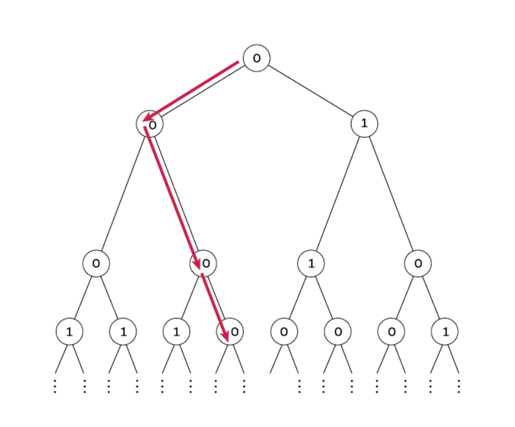

# Jane Street Puzzle - April 2025: Sum One, Somewhere

[View the official puzzle on Jane Street’s site »](https://www.janestreet.com/puzzles/sum-one-somewhere-index/)


This repository contains a detailed solution to the Jane Street puzzle from April 2025, titled "Sum One, Somewhere." The solution is presented in a Jupyter Notebook (`Sum_One_Somewhere.ipynb`) that provides a step-by-step mathematical derivation and a Python implementation to find the final answer.

## The Puzzle

For a fixed value of **p**, each node of an infinite complete binary tree is independently labeled **0** with probability **p**, and **1** otherwise.

The problem asks for the specific value of **p** for which there is exactly a **1/2 probability** that there exists an infinite path down the tree where the sum of the labels along the path is at most 1. This means the path consists of all 0s, with the possibility of a single 1.



## Solution Overview

The solution involves methods from probability theory and the analysis of branching processes. Here's a summary of the approach:

1. **Recursive Formulation**  
   The problem is modeled using recursive probability equations. We define `f(p)` as the probability of an infinite path with at most one `'1'` and `g(p)` as the probability of an all-0 path.

2. **System of Equations**  
   The relationships between the parent and child nodes in the binary tree lead to a system of two equations for `f(p)` and `g(p)`.

3. **Solving for Probabilities**  
   The equation for `g(p)` is a standard result in percolation theory, which is solved first.

4. **Deriving the Cubic Equation**  
   By substituting the solution for `g(p)` back into the equation for `f(p)` and setting `f(p) = 1/2` as required by the problem, we arrive at a cubic equation in terms of `p`.

5. **Numerical Solution**  
   The resulting cubic equation, `3p³ - 10p² + 12p - 4 = 0`, does not have simple rational roots. The solution is found numerically using the Newton–Raphson method.

## How to Use

To view the complete solution and run the code, you can use Jupyter Notebook.

### Prerequisites

- Python 3.x  
- Jupyter Notebook or JupyterLab

### Running the Notebook

1. **Clone this repository:**  
   ```bash
   git clone <repository-url>


2. **Navigate to the cloned directory:**

   ```bash
   cd <repository-directory>
   ```
3. **Launch Jupyter Notebook or JupyterLab:**

   ```bash
   jupyter notebook
   ```

   or

   ```bash
   jupyter lab
   ```
4. **Open** `Sum_One_Somewhere.ipynb` **to see the detailed explanation and execute the Python code cells.**

The notebook will guide you through the mathematical logic and the final code block will compute the value of **p** accurate to 10 decimal places.\`\`\`
