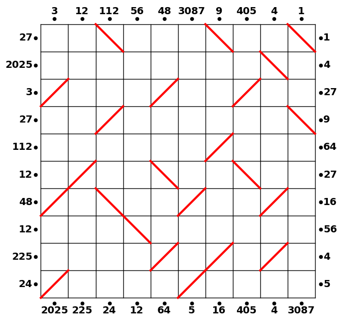

# Hall of Mirrors 3

Hall of Mirrors is a Python package designed to solve complex mirror placement puzzles. These puzzles involve placing diagonal mirrors in a square grid such that lasers entering the field follow paths whose segment lengths, when multiplied together, match given clue numbers. The solver employs factorization, ray simulation, and backtracking to build candidate solutions and ultimately determine the correct mirror placements.

## Puzzle Description

The puzzle solved by this package is **Hall of Mirrors 3** (March 2025, Jane Street):

- **Field:** A 10-by-10 square grid.
- **Lasers:** Positioned around the perimeter, each starting half a unit from the edge.
- **Clues:** Some lasers have numbers indicating the product of the segment lengths of the laser's path (e.g., a "75" path might be segmented into lengths 5, 3, and 5).
- **Rules:**
  - Diagonal mirrors (Type A: `/` and Type B: `\`) are placed within cells.
  - Mirrors cannot be placed in orthogonally adjacent cells.
  - The final step involves calculating the missing clue numbers along the perimeter by summing the clues for each side and obtaining the product of these sums.

## What the Code Does

1. **Factorization:**  
   Generates all possible factorizations for each clue number, considering constraints like maximum tuple length and maximum factor value.

2. **Ray Simulation:**  
   Simulates the trajectory of a laser ray entering the grid from a perimeter clue. The simulator:
   - Determines the initial position and direction based on the entry side.
   - Traverses the grid, reflecting the ray when a mirror is encountered using specified reflection rules.
   - Collects the path's cell coordinates to compare against the given clue product.

3. **Mirror Placement and Backtracking:**  
   Builds candidate solutions by placing mirrors according to valid ray paths. The algorithm uses a backtracking search to explore all placements until a complete solution, which satisfies all clues, is found.

4. **Visualization:**  
   Provides tools to visualize the solution. Once a valid configuration is found, the mirror placements and the corresponding ray trajectories are plotted on the grid.

## File Structure

```
March 2025/
├── LICENSE
├── README.md
├── setup.py
├── hall_of_mirrors/
│   ├── __init__.py
│   ├── solver.py           # Contains the backtracking and mirror placement algorithm
│   └── visualization.py    # Tools for plotting the grid and ray trajectories
└── solution/
    ├── solve_puzzle.py     # Example script for a smaller puzzle (e.g., 5x5 grid)
    └── solve_10x10_puzzle.py  # Script to solve the 10x10 puzzle described above
```

## Usage

### Installation

Clone the repository and install the package in development mode:

```bash
git clone https://github.com/yourusername/hall-of-mirrors.git
cd hall-of-mirrors
pip install -e .
```

### Running a Puzzle

To solve the 10x10 puzzle (Hall of Mirrors 3), run the following command from the project root:

```bash
python examples/solve_10x10_puzzle.py
```

### Example Code

Below is a brief overview of how to use the main functions of the package:

```python
from hall_of_mirrors import solve_puzzle, plot_solution
import matplotlib.pyplot as plt

# Define the 10x10 puzzle configuration
entries = [
    (112, ["top", 2]),
    (48, ["top", 4]),
    (3087, ["top", 5]),
    (9, ["top", 6]),
    (1, ["top", 9]),
    (27, ["left", 6]),
    (12, ["left", 2]),
    (225, ["left", 1]),
    (2025, ["bottom", 0]),
    (12, ["bottom", 3]),
    (64, ["bottom", 4]),
    (5, ["bottom", 5]),
    (405, ["bottom", 7]),
    (4, ["right", 8]),
    (27, ["right", 7]),
    (16, ["right", 3])
]

# Extract numbers and construct the clue position dictionary
numbers = [112, 48, 3087, 9, 1, 27, 12, 225, 2025, 12, 64, 5, 405, 4, 27, 16]
cluepos = {
    (2.5, 10.5): 112, (4.5, 10.5): 48, (5.5, 10.5): 3087, (6.5, 10.5): 9, (9.5, 10.5): 1,
    (-0.5, 6.5): 27, (-0.5, 2.5): 12, (-0.5, 1.5): 225, (0.5, -0.5): 2025, (3.5, -0.5): 12,
    (4.5, -0.5): 64, (5.5, -0.5): 5, (7.5, -0.5): 405, (10.5, 8.5): 4, (10.5, 7.5): 27, (10.5, 3.5): 16
}

# Solve the puzzle
solution = solve_puzzle(
    numbers=numbers,
    cluepos=cluepos,
    dic=dict(entries),
    max_tuple_length=25//2,  # Maximum factorization length
    max_factor=6,            # Maximum factor value
    grid_size=10
)

if solution:
    mirror_configs, final_matrix, trajectory_products = solution
    
    # Extract all mirrors and visualize the solution
    all_mirrors = []
    for config in mirror_configs:
        for mirror in config:
            if mirror not in all_mirrors:
                all_mirrors.append(mirror)
    
    fig = plot_solution(all_mirrors, 10, trajectory_products)
    plt.show()
else:
    print("No solution found!")
```

## Sample Output

After running the 10x10 puzzle, you should see a figure like the one below:



## License

This project is licensed under the MIT License - see the LICENSE file for details.
